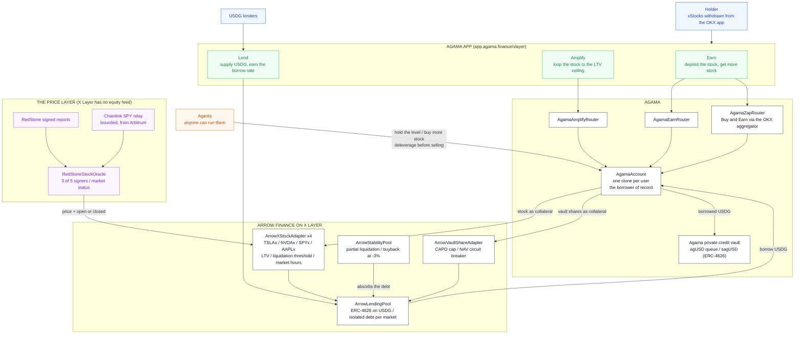

# Agama - make tokenized stocks productive on X Layer

Deposit a tokenized stock, get more of it back · **[Try the app](https://app.agama.finance/xlayer)**

X Layer has 928 tokenized equities and 1.5B$ of USDG, and no lending market that
accepts the first as collateral for the second. Agama builds that market: deposit
an xStock, the protocol borrows USDG against it, puts the USDG to work in a
private credit vault, and permissionless agents turn the yield back into **more
of the stock**. What grows is your share count, not a stablecoin balance.

Built for OKX Dev Day 2026, track **Build a Market**, on an Arrow Finance lending
pool ported and deployed by Agama as part of the Arrow x Agama partnership (Arrow
runs the same model on Robinhood Chain).

## Architecture

The wallet, the two products, the Agama account that borrows on your behalf, the
Arrow pool underneath, and the price layer X Layer does not have.



## What it does

- **Earn.** One deposit, nothing to set. The protocol borrows USDG at a safe
  level it picks, vaults it, and the agents keep it there: the stock rises, they
  borrow the difference; it falls, they repay from the yield already earned,
  never by selling your stock; the yield itself is bought back as more stock.
- **Amplify.** Borrow against the stock, buy more of the same stock, deposit it,
  again. A loop at L times carries an LTV of `(L - 1) / L`, so the market's own
  ceiling is the limit: 1.43x on TSLA and NVDA, 1.54x on AAPL, 2x on SPY.
- **Straight from the OKX app.** A withdrawal delivers the base xStock, not the
  ERC-4626 wrapper the markets take. Deposits accept it as is and closing hands
  it back the same way, ready for an OKX deposit.
- **The price layer is part of the build.** X Layer has no equity feed, from
  anyone. RedStone reports verified on-chain, a bounded Chainlink relay for SPY,
  market hours, a weekend buffer, and no fallback price ever.
- **No buttons for the automation.** The position card says the agents are
  running and what they last did. Anyone can run them; we are one caller.

## Where it lives

| | |
|---|---|
| App | https://app.agama.finance/xlayer (X Layer Testnet, chain 1952) |
| Test funds | The Faucet tab mints USDG and the four stocks in one transaction. Gas at https://web3.okx.com/xlayer/faucet |
| Contracts | 26, all source-verified on OKLink. Every address: [`deployments/1952.json`](deployments/1952.json) |
| The detail | [docs/ARCHITECTURE.md](docs/ARCHITECTURE.md) |

The two to open first, because users call them directly and so they are the ones
with transactions to look at:

- **ArrowLendingPool** [`0x3F1DA390bbe93916065fB4045ae87c9aC6cf982a`](https://www.oklink.com/xlayer-test/address/0x3F1DA390bbe93916065fB4045ae87c9aC6cf982a)
- **AgamaEarnRouter** [`0xa82CEae929e6aA6C5831256559cA563A79b62435`](https://www.oklink.com/xlayer-test/address/0xa82CEae929e6aA6C5831256559cA563A79b62435)

## Run it

```bash
forge test                         # 83 tests, most on a fork of X Layer mainnet
./scripts/check.sh                 # the five steps CI runs, before pushing
python3 scripts/e2e.py testnet     # 18 steps, real transactions on testnet
python3 scripts/ui_e2e.py          # a headless browser on the live app, real signer
cd web && pnpm dev                 # http://localhost:3004/xlayer
```
