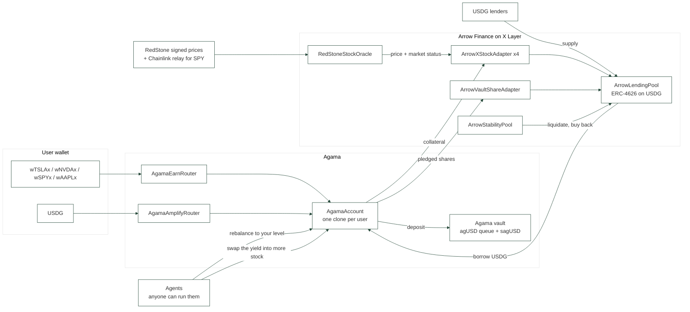

# Agama x Arrow on X Layer

**Earn on your stocks** and **Amplify**: two one-click products on top of an Arrow Finance lending pool on X Layer, deployed by Agama as part of the Arrow x Agama partnership (Arrow runs the same model on Robinhood Chain).

- **Earn on your stocks: deposit the stock, get more stock.** Deposit a tokenized stock (xStocks by Backed: wTSLAx, wNVDAx, wSPYx, wAAPLx) and pick one level on a slider. Everything after that is automatic: the protocol borrows USDG against it, puts the USDG in the Agama RWA vault, and permissionless agents keep it there:
  - the stock goes up, the agent borrows the difference and vaults it, so the position never drifts below the level you picked;
  - the stock goes down, the agent repays from the yield already earned, never by selling your stock;
  - the yield the vault produced is swapped back into **more of your stock** and added as collateral, so what grows is your share count, not a stablecoin balance;
  - and if it ever gets close to trouble, a soft deleverage spends the yield buffer first. **Your stock is never the first thing sold.**
- **Buy and Earn.** Do not hold the stock yet? One transaction buys it through the OKX Onchain OS DEX aggregator and opens the Earn position with it.
- **Straight from the OKX app.** Withdrawing a tokenized stock from OKX to X Layer delivers the BASE xStock (TSLAx), not the ERC-4626 wrapper the markets take. `openWithBase` wraps it on the way in and `closeToBase` hands it back, so a position can be opened from an OKX withdrawal and sent straight back to an OKX deposit.
- **Amplify.** Loop the Agama vault on Arrow up to 3x in one transaction. `net APY = vaultAPY + (L - 1) x (vaultAPY - borrowAPR)`. If the carry turns negative, anyone can unwind the loop back to 1x.

Built for OKX Dev Day 2026, track **Build a Market** (tokenized stocks and RWA on X Layer).

**Live app (X Layer testnet):** https://app.agama.finance/xlayer (the "Get test tokens" button mints test USDG and xStocks; test OKB for gas at https://web3.okx.com/xlayer/faucet).

It is not a demo page: the front is the production Agama app, forked whole into `web/`, with X Layer added as one more network beside Stellar, Sui, Starknet, MagicBlock and Arbitrum. Same shell, same design, same connect flow. Open the network menu and switch.

## Why X Layer

- **xStocks are native on X Layer**: 928 tokenized equities, about 173M$ of market cap. No lending market accepts them as collateral today (Aave on X Layer lists none, and there is no Morpho or Euler).
- **USDG is X Layer's dollar**: 1.51B$ of supply, almost none of it in DeFi. Arrow lenders earn a borrow rate backed by overcollateralized stock loans instead of leaving it idle.
- **No stock price a lending market can read**: Chainlink has no equity push feed on X Layer, and Data Streams is not live there either. The OKX team confirmed it on 2026-09-23, and the chain agrees: the VerifierProxy is deployed on both networks but mainnet never had a verifier initialized on it (`getVerifier` returns the zero address). So the price layer is something a lender has to build, and that is what `RedStoneStockOracle` is.

## Architecture



| Contract | Role |
|---|---|
| `ArrowLendingPool` | ERC-4626 pool on USDG. Per-market isolated debt, Aave-style indices. Borrows are gated by the adapter (`borrowAllowed`). Liquidation is **partial**: the stability pool absorbs the debt and receives collateral worth `debt x (1 + bonus)`, the rest stays with the borrower. |
| `ArrowXStockAdapter` | One per stock. Holds the **ERC-4626 wrapper** (the base xStock rebases), prices it as `stock price x wrapper.convertToAssets(1e18)` so dividends are counted. Market closed: no new borrows and a lower liquidation threshold (weekend buffer). |
| `ArrowVaultShareAdapter` | Agama vault shares as collateral: exchange-rate pricing (never a hardcoded 1$), CAPO growth cap, 3% haircut, circuit breaker that pauses borrows if the NAV drops 2% under the snapshot, without blocking liquidations. |
| `ArrowStabilityPool` | Liquidation backstop (Arrow model). `liquidate` is permissionless. Seized stocks are sold to anyone at the oracle price minus 3% (`buyCollateral`), since X Layer DEX depth for xStocks is a few dollars. Seized vault shares are redeemed with priority. |
| `RedStoneStockOracle` | The oracle the markets read. Adds the RedStone path on top of the two below: permissionless `pushRedStone`, 3 of 5 signers, median, 8 to 18 decimals, and a refusal to move a price while the keeper has the market marked closed. |
| `DataStreamsStockOracle` | Stores prices a lending market can read. Verifies Chainlink Data Streams v11 reports on-chain (permissionless) and accepts a bounded keeper relay. Market status aware (24/5), sequencer-uptime check, never falls back to a default price. |
| `AgamaAccount` | The borrower of record, one clone per user, and where the automation lives. Earn open/close, `rebalance` (anyone: hold the LTV the owner picked, in both directions), `compoundIntoStock` (anyone: turn vault yield above the debt into more stock, only through a router the zap allowlists), `softDeleverage` (anyone, HF < 1.15 -> back to 1.40), Amplify loop and unwind, `autoUnwind` spread guard. Nothing here needs our keeper: it is convenience, not control. |
| `AgamaZapRouter` | Buy and Earn. Calls the OKX DEX aggregator with calldata built off-chain, measures what actually arrived, and opens the Earn position for the buyer. Only governor-allowlisted routers can be called or approved, and the amount bought is checked against the aggregator's `minReceiveAmount`. |
| `agUSDQueue` / `sagUSD` | The Agama vault on USDG. On X Layer it gains a `PRIORITY_ROLE` for the stability pool and a one-shot **forbidden vault**: the vault can never lend into the pool that accepts its own shares (the Stream xUSD / Elixir loop). |

## What the agents do, and what they cannot do

| Agent action | Trigger | Guard |
|---|---|---|
| `rebalance` up | stock rose, LTV drifted 1% under target | cannot exceed the market's max LTV, borrow blocked while the market is closed |
| `rebalance` down | stock fell, LTV drifted 1% over target | repays from the yield buffer only, never sells the stock |
| `compoundIntoStock` | vault yield above the debt | only the surplus over the debt is spent, so the protective buffer stays; swaps only through an allowlisted router with a slippage floor |
| `softDeleverage` | HF below 1.15 | repays to HF 1.40 out of the buffer, stock untouched |
| `autoUnwind` (Amplify) | borrow rate above the vault's measured APY | unwinds to 1x, equity stays with the owner |

All five are permissionless. `scripts/keeper.py` runs them on a timer, but anyone can, and Agama's keeper is one caller among others rather than a privileged one.

**The app gives the user no button for any of this.** The position card says the agents are running, names the level being held, shows how much stock they have added since the deposit and what the last action was. Nothing more. A "Rebalance now" button would say that this is a chore the user owns, which is the opposite of the product.

## Risk parameters (v1)

| Collateral | Max LTV | Liquidation threshold | Bonus | Weekend buffer |
|---|---|---|---|---|
| wSPYx | 50% | 60% | 6% | -5 pts |
| wTSLAx, wNVDAx | 30% | 40% | 10% | -8 pts |
| wAAPLx | 35% | 45% | 8% | -8 pts |
| Agama vault shares | 70% | 80% | 5% | none (3% haircut) |

The slider goes from 0 to the market maximum and Earn defaults to 25%. A single stock cannot take the 70% an index-style asset could: earnings gaps of 20% happen, and the weekend buffer has to sit under the liquidation threshold. Amplify is capped at 3x. Rates: 1% base, 6% at 90% utilization.

## What was built during the OKX Dev Day build period

Everything under `src/arrow/oracle`, `src/arrow/adapters/Arrow*`, `src/arrow/ArrowStabilityPool.sol`, `src/agama`, `script`, `scripts`, `test` is new. The commit history shows the order.

Ported from the Agama protocol and changed for X Layer:
- `ArrowLendingPool` (from the Agama LendingPool): borrow gating, partial liquidation, bad debt only once the collateral is gone, USDG decimals, no settlement vault.
- `agUSDQueue`: priority redemptions and the anti-circularity guard.

Imported unchanged: `DebtToken`, rate and reserve libraries, `agUSD`, `sagUSD`.

## The front is a fork of the Agama app, not a page of its own

`web/` is the production front of [app.agama.finance](https://app.agama.finance), copied whole at the commit that was live, in one commit of its own so everything after it reads as a diff. That app is already multi-chain: Stellar, Sui, Starknet, MagicBlock and Arbitrum each plug into the same shell as a platform, with the same navbar, the same cream panels on the same green frame, the same connect pill.

X Layer became one more platform in it. That is the whole point: the Dev Day build is not a demo that looks like a demo, it is Agama with a new network in it, and every component it reuses is one we did not have to invent for a deadline.

What was added on top of the fork: the `xlayer` platform and its network entry, `lib/xlayer` reading the Foundry deployment, the Earn page, Amplify, Lend, the testnet faucet, and the OKX aggregator route. What was removed: the standalone front this build started with.

## Run it

```bash
forge build
forge test                         # 73 tests, most on a fork of X Layer mainnet (real USDG, real xStocks)

# local X Layer mainnet fork with the full stack and real Chainlink prices
anvil --fork-url https://xlayerrpc.okx.com --chain-id 1961 &
./scripts/fork-reset.sh            # deploy + seed + one keeper tick
python3 scripts/e2e.py fork        # full scenario with real transactions

# front
cd web && pnpm install && pnpm dev # http://localhost:3004/xlayer
```

The end-to-end scenario: Alice opens Earn on 10 wTSLAx at 25%, Carol at 30% without a buffer, Bob opens Amplify 3x; vault yield is settled; TSLA crashes to 71.5%; the keeper soft-deleverages Alice (she keeps all 10 wTSLAx) and the stability pool partially liquidates Carol (she keeps 5.4 of 10); a buyer takes the seized stock at a 3% discount; TSLA recovers and everyone exits.

## Deployments

### X Layer testnet (chain 1952), live

All contracts are source-verified on the OKLink explorer. One note, until the next deploy: `AgamaAccount` gained an on-chain slippage floor on the compound path after this deployment went out, so the live implementation is one commit behind `src/`. `./scripts/testnet-refresh.sh` redeploys, reverifies and regenerates everything in one go. X Layer testnet has no USDG and no xStocks, so they are public-faucet stand-ins there (same decimals, same ERC-4626 wrapper shape); the Arrow x Agama contracts are the exact mainnet code and wiring.

| Contract | Address |
|---|---|
| ArrowLendingPool | [`0xb258A029917F3bB0d48166f5395043154A784b6C`](https://www.okx.com/web3/explorer/xlayer-test/address/0xb258A029917F3bB0d48166f5395043154A784b6C) |
| ArrowStabilityPool | [`0xB29bA7cDf2a33d31786EC5c3A11F5DBCe5948a3e`](https://www.okx.com/web3/explorer/xlayer-test/address/0xB29bA7cDf2a33d31786EC5c3A11F5DBCe5948a3e) |
| RedStoneStockOracle | [`0xE5926fAD18C2DCA67efA2Fe11246A187397b66F6`](https://www.okx.com/web3/explorer/xlayer-test/address/0xE5926fAD18C2DCA67efA2Fe11246A187397b66F6) |
| ArrowXStockAdapter (TSLA) | [`0x9d65Bc182b2215D36671afB9002b808A72e24520`](https://www.okx.com/web3/explorer/xlayer-test/address/0x9d65Bc182b2215D36671afB9002b808A72e24520) |
| ArrowXStockAdapter (NVDA) | [`0xB5B202bA6dE5FA7D33349bB62d08B2cBf6331364`](https://www.okx.com/web3/explorer/xlayer-test/address/0xB5B202bA6dE5FA7D33349bB62d08B2cBf6331364) |
| ArrowXStockAdapter (SPY) | [`0xF4dbcF7C6D8B0a89DCC8aA96500516396A89BD89`](https://www.okx.com/web3/explorer/xlayer-test/address/0xF4dbcF7C6D8B0a89DCC8aA96500516396A89BD89) |
| ArrowXStockAdapter (AAPL) | [`0x73933f19D51017c0603DdDF32698c1C019E377c6`](https://www.okx.com/web3/explorer/xlayer-test/address/0x73933f19D51017c0603DdDF32698c1C019E377c6) |
| ArrowVaultShareAdapter | [`0x43E03b5cc3017756701d8dD4B4BE149953A1e9df`](https://www.okx.com/web3/explorer/xlayer-test/address/0x43E03b5cc3017756701d8dD4B4BE149953A1e9df) |
| AgamaEarnRouter | [`0xE1CE8bC8DA4d531235b7B953c88FaDdD6D2107d8`](https://www.okx.com/web3/explorer/xlayer-test/address/0xE1CE8bC8DA4d531235b7B953c88FaDdD6D2107d8) |
| AgamaAmplifyRouter | [`0x64d40ccd6F52adC37c0bb5044BB108FD010526D4`](https://www.okx.com/web3/explorer/xlayer-test/address/0x64d40ccd6F52adC37c0bb5044BB108FD010526D4) |
| AgamaZapRouter | [`0x3F8C419212E286ac8aAf81eaBb52084b03498a24`](https://www.okx.com/web3/explorer/xlayer-test/address/0x3F8C419212E286ac8aAf81eaBb52084b03498a24) |
| AgamaAccountFactory | [`0xFDC190129e819ebE8eedcD12DC1C8b03B92CeA79`](https://www.okx.com/web3/explorer/xlayer-test/address/0xFDC190129e819ebE8eedcD12DC1C8b03B92CeA79) |
| agUSDQueue (Agama vault) | [`0xA2d2DCef144c50ac54dF3CB213B6c91d6cb43B05`](https://www.okx.com/web3/explorer/xlayer-test/address/0xA2d2DCef144c50ac54dF3CB213B6c91d6cb43B05) |
| sagUSD (Agama vault share) | [`0xD19c6e8E05e2C6f43Cf954c2369f644644Bf0208`](https://www.okx.com/web3/explorer/xlayer-test/address/0xD19c6e8E05e2C6f43Cf954c2369f644644Bf0208) |
| tUSDG (testnet stand-in) | [`0x22d746ecf7B435AF2d2533005D449aF9AE667197`](https://www.okx.com/web3/explorer/xlayer-test/address/0x22d746ecf7B435AF2d2533005D449aF9AE667197) |
| wTSLAx (testnet stand-in) | [`0x2578339E88CfcF25889Ce41841fa243104c789b0`](https://www.okx.com/web3/explorer/xlayer-test/address/0x2578339E88CfcF25889Ce41841fa243104c789b0) |
| TestDexRouter (testnet stand-in) | [`0xA1589F910D45A7CC37D0B66338bE67A1130e77F4`](https://www.okx.com/web3/explorer/xlayer-test/address/0xA1589F910D45A7CC37D0B66338bE67A1130e77F4) |

Full list: [`deployments/1952.json`](deployments/1952.json).

The end-to-end scenario below ran against this deployment with real transactions (`python3 scripts/e2e.py testnet`):

```
2. Alice: Earn on 10 wTSLAx at 25% LTV     borrowed 948.90 USDG, HF 1.600, parked in the Agama vault
4. Bob: Amplify 1,000 USDG at 3x           exposure 3000.00, debt 2000.00, HF 1.164
6. TSLA falls 28%                          Alice HF 1.144, Carol HF 0.953
7. keeper                                  Alice soft-deleveraged to HF 1.400, keeps all 10 wTSLAx
                                           Carol liquidated partially: SP seized 4.615, Carol keeps 5.385
8. buyer                                   4.615 wTSLAx bought at a 3% discount
15. Buy and Earn                           300 USDG bought 0.788017 wTSLAx and opened the position, one transaction
16. agents, the stock rallies              debt 948.90 -> 1138.68 USDG, back at the 25% the user picked
16. agents, the yield compounds            10.000000 -> 10.189642 wTSLAx, no user action
17. OKX rail                               5 base xStock in, closed back into 5.000000 base xStock
18. Dave, the lender                       redeemed 1000.000003 USDG for 1,000 supplied
E2E PASSED
```

### X Layer mainnet (chain 196)

Not deployed: the hackathon demo lives on testnet so anyone can try it with the faucet. Mainnet is still where the tests run: the 73 Foundry tests and the same end-to-end scenario execute on a fork of X Layer mainnet against the real USDG, the real Backed wrappers and the real OKX DEX aggregator (`./scripts/fork-reset.sh && python3 scripts/e2e.py fork`, and `scripts/zap_check.py`). `script/Deploy.s.sol` and `scripts/mainnet-deploy.sh` are ready for a guarded launch after the hackathon.

## OKX integrations

| Piece | What it is used for |
|---|---|
| X Layer | Every contract, verified on the OKLink explorer |
| xStocks (Backed) | Collateral, through the ERC-4626 wrappers |
| OKX app withdrawals | The base xStock an OKX withdrawal sends is accepted directly (`openWithBase`), and a position closes back into it (`closeToBase`) for a deposit to OKX |
| USDG | Base asset of the Arrow pool and of the Agama vault |
| Onchain OS DEX API | The Buy and Earn zap: `/api/v6/dex/aggregator/{quote,approve-transaction,swap}` on `chainIndex=196`, signed server side (`scripts/okx_dex.py`, and the app's `/api/zap` route). The aggregator covers mainnet only, so the live testnet app routes the same zap through a stand-in router priced at the oracle, and the real aggregator path is exercised on a mainnet fork |
| OKX Wallet | First connector in the app |

The zap runs against the real aggregator on a fork of X Layer mainnet:

```bash
anvil --fork-url https://xlayerrpc.okx.com --chain-id 196 --port 8546 &
DEPLOY_FILE=196-fork.json forge script script/Deploy.s.sol --rpc-url http://127.0.0.1:8546 --broadcast --private-key <anvil key>
python3 scripts/zap_check.py 200
# quote: 0.527058 wTSLAx at $379.66 -> buyAndEarn mined in 1,307,394 gas
# position: 0.527023 wTSLAx worth 200.14 USDG, debt 50.03 USDG, HF 1.600
```

Two things we learned doing it, both handled in the code: the aggregator's JIT routes are signed per wallet and expire within seconds, so the zap pins AMM routes with `dexIds`; and those market-maker signatures are bound to chain 196, so a fork must keep that chain id.

The agents go through the same aggregator, and that is the one path the testnet cannot prove: there the swap venue is a stand-in priced at our own oracle, so it can never disagree with us. `scripts/compound_check.py` spends real vault yield into the real xStock liquidity, with the agent run by a wallet that owns nothing:

```bash
python3 scripts/compound_check.py 5000
# surplus 4495.50 USDG -> 11.817595 wTSLAx worth 4492.95, 0.05% off the oracle, 770,563 gas
# and at 450 USDG: 0.05% the other way, better than the oracle
```

That is what calibrates the 3% floor in `MAX_COMPOUND_SLIPPAGE_BPS`: real execution sits two orders of magnitude inside it, so the floor blocks abuse without blocking the product.

## Oracle: how prices reach X Layer

X Layer has no equity price a contract can read, so the oracle is part of the product. Three write paths, one contract, in order of trust:

1. **RedStone signed prices** (TSLA, NVDA, AAPL, what runs today): anyone can call `pushRedStone` with a RedStone data package appended to the calldata. The contract recovers the signatures and requires **3 of the 5 authorised signers**, takes the median, and checks the package is under three minutes old. Nothing is deployed by RedStone: the pull model lives entirely in the consumer, which is why it works on X Layer at all. Live on testnet: TSLA 378.83, NVDA 228.86, AAPL 339.76, verified on-chain.
2. **Chainlink relay** (SPY, and market status): RedStone does not publish SPY or ETFs, so the keeper relays the Chainlink SPY/USD push feed from Arbitrum through `pushMany`, bounded on-chain by a 15% per-update deviation cap (50% on a reopen gap). The keeper also owns the **market status**: RedStone keeps publishing out of session with a fresh timestamp and a flat value, so a signed package proves freshness, never that the market trades. A signed push is refused while a ticker is marked closed, which is what keeps the Friday close frozen all weekend. The corollary is that **RedStone cannot lift its own freeze**: the relay has to carry the RedStone tickers once at the reopen, and if it does not they stay shut for good. That was a live bug in the keeper, found and fixed on 2026-09-24.
3. **Chainlink Data Streams** (dormant): `pushReports` verifies a signed v11 report against the X Layer VerifierProxy, enforcing expiry, age and ordering ourselves since the FeeManager that usually does it is absent. Data Streams is not live on X Layer, so this path ships unused; switching it on is a governance call, no redeploy.

Licensing note: the RedStone consumer contracts are vendored under `lib/redstone-evm-connector` and are **BUSL-1.1**. Redistribution and non-production use are granted, production use needs a grant from the licensor. Fine for this deployment, to be agreed with RedStone before a production launch.

## Known limits, stated plainly

- The Agama vault's private-credit yield is settled on-chain by the operator (`settleYield`). The credit deployment itself happens off-chain with asset managers.
- The keeper relay is a trusted role, bounded by deviation caps; Data Streams would remove that trust, but it is not on X Layer (see the oracle section).
- The stock added by the agents is measured against a deposit baseline kept in the browser: the chain records no such baseline, and the public RPC caps log scans at 100 blocks. The collateral itself is read on chain; only the "since you deposited" part is local.
- Instant exits and soft deleverage rely on the vault's liquid reserve (50% target). Larger exits go through the redemption queue.
- `autoUnwind` needs two vault snapshots with measured yield before it can fire, by design.
- Not audited. Mainnet deployment runs with small caps.
