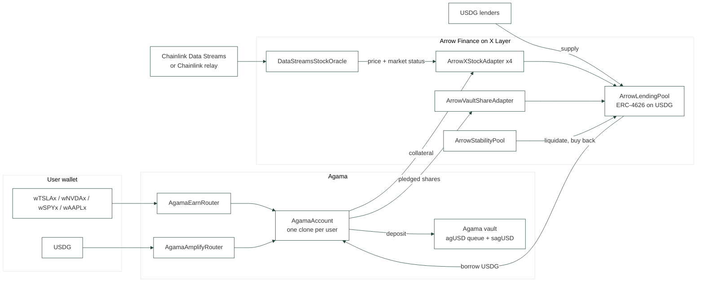

# Agama x Arrow on X Layer

**Earn on your stocks** and **Amplify**: two one-click products on top of an Arrow Finance lending pool on X Layer, deployed by Agama as part of the Arrow x Agama partnership (Arrow runs the same model on Robinhood Chain).

- **Earn on your stocks.** Deposit a tokenized stock (xStocks by Backed: wTSLAx, wNVDAx, wSPYx, wAAPLx), borrow USDG at the LTV you choose, and the USDG goes into the Agama RWA vault. You keep the stock exposure and earn the vault yield minus the borrow rate on the borrowed amount. The vault shares stay in your account as a buffer: if the stock falls, anyone can trigger a soft deleverage that repays debt from those shares. **Your stock is never the first thing sold.**
- **Buy and Earn.** Do not hold the stock yet? One transaction buys it through the OKX Onchain OS DEX aggregator and opens the Earn position with it.
- **Amplify.** Loop the Agama vault on Arrow up to 3x in one transaction. `net APY = vaultAPY + (L - 1) x (vaultAPY - borrowAPR)`. If the carry turns negative, anyone can unwind the loop back to 1x.

Built for OKX Dev Day 2026, track **Build a Market** (tokenized stocks and RWA on X Layer).

**Live app (X Layer testnet):** https://agama-xlayer.vercel.app (the "Get test tokens" button mints test USDG and xStocks; test OKB for gas at https://web3.okx.com/xlayer/faucet).

## Why X Layer

- **xStocks are native on X Layer**: 928 tokenized equities, about 173M$ of market cap. No lending market accepts them as collateral today (Aave on X Layer lists none, and there is no Morpho or Euler).
- **USDG is X Layer's dollar**: 1.51B$ of supply, almost none of it in DeFi. Arrow lenders earn a borrow rate backed by overcollateralized stock loans instead of leaving it idle.
- **Chainlink Data Streams publishes US equities on X Layer**: verification is free on-chain (no FeeManager on the X Layer VerifierProxy), so the oracle accepts signed reports from anyone.

## Architecture



| Contract | Role |
|---|---|
| `ArrowLendingPool` | ERC-4626 pool on USDG. Per-market isolated debt, Aave-style indices. Borrows are gated by the adapter (`borrowAllowed`). Liquidation is **partial**: the stability pool absorbs the debt and receives collateral worth `debt x (1 + bonus)`, the rest stays with the borrower. |
| `ArrowXStockAdapter` | One per stock. Holds the **ERC-4626 wrapper** (the base xStock rebases), prices it as `stock price x wrapper.convertToAssets(1e18)` so dividends are counted. Market closed: no new borrows and a lower liquidation threshold (weekend buffer). |
| `ArrowVaultShareAdapter` | Agama vault shares as collateral: exchange-rate pricing (never a hardcoded 1$), CAPO growth cap, 3% haircut, circuit breaker that pauses borrows if the NAV drops 2% under the snapshot, without blocking liquidations. |
| `ArrowStabilityPool` | Liquidation backstop (Arrow model). `liquidate` is permissionless. Seized stocks are sold to anyone at the oracle price minus 3% (`buyCollateral`), since X Layer DEX depth for xStocks is a few dollars. Seized vault shares are redeemed with priority. |
| `DataStreamsStockOracle` | Stores prices a lending market can read. Verifies Chainlink Data Streams v11 reports on-chain (permissionless) and accepts a bounded keeper relay. Market status aware (24/5), sequencer-uptime check, never falls back to a default price. |
| `AgamaAccount` | The borrower of record, one clone per user. Earn open/close, `softDeleverage` (anyone, HF < 1.15 -> back to 1.40), Amplify loop and unwind, `autoUnwind` spread guard. |
| `AgamaZapRouter` | Buy and Earn. Calls the OKX DEX aggregator with calldata built off-chain, measures what actually arrived, and opens the Earn position for the buyer. Only governor-allowlisted routers can be called or approved, and the amount bought is checked against the aggregator's `minReceiveAmount`. |
| `agUSDQueue` / `sagUSD` | The Agama vault on USDG. On X Layer it gains a `PRIORITY_ROLE` for the stability pool and a one-shot **forbidden vault**: the vault can never lend into the pool that accepts its own shares (the Stream xUSD / Elixir loop). |

## Risk parameters (v1)

| Collateral | Max LTV | Liquidation threshold | Bonus | Weekend buffer |
|---|---|---|---|---|
| wSPYx | 50% | 60% | 6% | -5 pts |
| wTSLAx, wNVDAx | 30% | 40% | 10% | -8 pts |
| wAAPLx | 35% | 45% | 8% | -8 pts |
| Agama vault shares | 70% | 80% | 5% | none (3% haircut) |

Earn defaults to 25% LTV. Amplify is capped at 3x. Rates: 1% base, 6% at 90% utilization.

## What was built during the OKX Dev Day build period

Everything under `src/arrow/oracle`, `src/arrow/adapters/Arrow*`, `src/arrow/ArrowStabilityPool.sol`, `src/agama`, `script`, `scripts`, `test` is new. The commit history shows the order.

Ported from the Agama protocol and changed for X Layer:
- `ArrowLendingPool` (from the Agama LendingPool): borrow gating, partial liquidation, bad debt only once the collateral is gone, USDG decimals, no settlement vault.
- `agUSDQueue`: priority redemptions and the anti-circularity guard.

Imported unchanged: `DebtToken`, rate and reserve libraries, `agUSD`, `sagUSD`.

## Run it

```bash
forge build
forge test                         # 54 tests, most on a fork of X Layer mainnet (real USDG, real xStocks)

# local X Layer mainnet fork with the full stack and real Chainlink prices
anvil --fork-url https://rpc.xlayer.tech --chain-id 1961 &
./scripts/fork-reset.sh            # deploy + seed + one keeper tick
python3 scripts/e2e.py fork        # full scenario with real transactions

# front
cd app && pnpm install && pnpm dev # http://localhost:3021
```

The end-to-end scenario: Alice opens Earn on 10 wTSLAx at 25%, Carol at 30% without a buffer, Bob opens Amplify 3x; vault yield is settled; TSLA crashes to 71.5%; the keeper soft-deleverages Alice (she keeps all 10 wTSLAx) and the stability pool partially liquidates Carol (she keeps 5.4 of 10); a buyer takes the seized stock at a 3% discount; TSLA recovers and everyone exits.

## Deployments

### X Layer testnet (chain 1952), live

All 26 contracts are source-verified on the OKLink explorer. X Layer testnet has no USDG and no xStocks, so they are public-faucet stand-ins there (same decimals, same ERC-4626 wrapper shape); the Arrow x Agama contracts are the exact mainnet code and wiring.

| Contract | Address |
|---|---|
| ArrowLendingPool | [`0x6199f7C36661BbA1d4B6fF626a2AC298C77624d0`](https://www.okx.com/web3/explorer/xlayer-test/address/0x6199f7C36661BbA1d4B6fF626a2AC298C77624d0) |
| ArrowStabilityPool | [`0x6D8871d6f803e886A16839b8C90a3237f643eaFd`](https://www.okx.com/web3/explorer/xlayer-test/address/0x6D8871d6f803e886A16839b8C90a3237f643eaFd) |
| DataStreamsStockOracle | [`0xa6dF3Af29e042A05c5F745D27c4d384316822a1b`](https://www.okx.com/web3/explorer/xlayer-test/address/0xa6dF3Af29e042A05c5F745D27c4d384316822a1b) |
| ArrowXStockAdapter (TSLA) | [`0xFfB857B13aD1111778Fe2357cC824692bC4C657b`](https://www.okx.com/web3/explorer/xlayer-test/address/0xFfB857B13aD1111778Fe2357cC824692bC4C657b) |
| ArrowXStockAdapter (NVDA) | [`0x1273167cF8C1b000b7326cAeb49CF66Ca82e5401`](https://www.okx.com/web3/explorer/xlayer-test/address/0x1273167cF8C1b000b7326cAeb49CF66Ca82e5401) |
| ArrowXStockAdapter (SPY) | [`0xCD407365880b44A5a5bA662b4Cb6b09ebd9342fe`](https://www.okx.com/web3/explorer/xlayer-test/address/0xCD407365880b44A5a5bA662b4Cb6b09ebd9342fe) |
| ArrowXStockAdapter (AAPL) | [`0xE069c2c3bF51F474f00145DF15565137724556C6`](https://www.okx.com/web3/explorer/xlayer-test/address/0xE069c2c3bF51F474f00145DF15565137724556C6) |
| ArrowVaultShareAdapter | [`0x26A7bafb325b41febd6a4A2B810cB9Ab87A4A0dD`](https://www.okx.com/web3/explorer/xlayer-test/address/0x26A7bafb325b41febd6a4A2B810cB9Ab87A4A0dD) |
| AgamaEarnRouter | [`0x2A7D5b533609e012C20dB6A14D468c2433aE11f6`](https://www.okx.com/web3/explorer/xlayer-test/address/0x2A7D5b533609e012C20dB6A14D468c2433aE11f6) |
| AgamaAmplifyRouter | [`0x7537433c56d7a1fBE41a679078DC869AF52EE507`](https://www.okx.com/web3/explorer/xlayer-test/address/0x7537433c56d7a1fBE41a679078DC869AF52EE507) |
| AgamaZapRouter | [`0x72b4e1FE2B83B0F8A9b9CefA24a9BdEa6FDCe3f1`](https://www.okx.com/web3/explorer/xlayer-test/address/0x72b4e1FE2B83B0F8A9b9CefA24a9BdEa6FDCe3f1) |
| AgamaAccountFactory | [`0x85d40Fd14320377F0dea30FE221DBBB0379B58a0`](https://www.okx.com/web3/explorer/xlayer-test/address/0x85d40Fd14320377F0dea30FE221DBBB0379B58a0) |
| agUSDQueue (Agama vault) | [`0x8aFae512e6B1C261C1f0A1e6bc07417B6296A8e8`](https://www.okx.com/web3/explorer/xlayer-test/address/0x8aFae512e6B1C261C1f0A1e6bc07417B6296A8e8) |
| sagUSD (Agama vault share) | [`0xec6bb91ECa4847E087c3065A8Da93199602DBF0f`](https://www.okx.com/web3/explorer/xlayer-test/address/0xec6bb91ECa4847E087c3065A8Da93199602DBF0f) |
| tUSDG (testnet stand-in) | [`0x5B1fd8A3ceC4c47cd078E5e216b8e9621B15355B`](https://www.okx.com/web3/explorer/xlayer-test/address/0x5B1fd8A3ceC4c47cd078E5e216b8e9621B15355B) |
| wTSLAx (testnet stand-in) | [`0x2e25d320Ad637F46Ae34443d98F6BE47b85310Db`](https://www.okx.com/web3/explorer/xlayer-test/address/0x2e25d320Ad637F46Ae34443d98F6BE47b85310Db) |
| TestDexRouter (testnet stand-in) | [`0x5d3D8EEac2CEE90e06C0892A9a6A120a5ae740A6`](https://www.okx.com/web3/explorer/xlayer-test/address/0x5d3D8EEac2CEE90e06C0892A9a6A120a5ae740A6) |

Full list: [`deployments/1952.json`](deployments/1952.json).

The end-to-end scenario below ran against this deployment with real transactions (`python3 scripts/e2e.py testnet`):

```
2. Alice: Earn on 10 wTSLAx at 25% LTV     borrowed 939.56 USDG, HF 1.600, 939.56 USDG parked in the vault
3. Carol: Earn at 30% LTV, no buffer       debt 1127.47 USDG
4. Bob: Amplify 1,000 USDG at 3x           exposure 3000.00, debt 2000.00, HF 1.164
5. vault yield settled                     Bob's exposure 3000.00 -> 3013.50 USDG
6. TSLA 375.82 -> 268.71                   Alice HF 1.144, Carol HF 0.953
7. keeper                                  Alice soft-deleveraged to HF 1.400, keeps all 10 wTSLAx
                                           Carol liquidated partially: SP seized 4.615, Carol keeps 5.385
8. buyer                                   4.615 wTSLAx bought at a 3% discount
9. exits                                   Bob 1013.50 USDG back for 1,000 in, Alice 10 wTSLAx back
E2E PASSED
```

### X Layer mainnet (chain 196)

Not deployed: the hackathon demo lives on testnet so anyone can try it with the faucet. Mainnet is still where the tests run: the 54 Foundry tests and the same end-to-end scenario execute on a fork of X Layer mainnet against the real USDG, the real Backed wrappers and the real OKX DEX aggregator (`./scripts/fork-reset.sh && python3 scripts/e2e.py fork`, and `scripts/zap_check.py`). `script/Deploy.s.sol` and `scripts/mainnet-deploy.sh` are ready for a guarded launch after the hackathon.

## OKX integrations

| Piece | What it is used for |
|---|---|
| X Layer | Every contract, verified on the OKLink explorer |
| xStocks (Backed) | Collateral, through the ERC-4626 wrappers |
| USDG | Base asset of the Arrow pool and of the Agama vault |
| Onchain OS DEX API | The Buy and Earn zap: `/api/v6/dex/aggregator/{quote,approve-transaction,swap}` on `chainIndex=196`, signed server side (`scripts/okx_dex.py`, and the app's `/api/zap` route). The aggregator covers mainnet only, so the live testnet app routes the same zap through a stand-in router priced at the oracle, and the real aggregator path is exercised on a mainnet fork |
| OKX Wallet | First connector in the app |

The zap runs against the real aggregator on a fork of X Layer mainnet:

```bash
anvil --fork-url https://rpc.xlayer.tech --chain-id 196 --port 8546 &
DEPLOY_FILE=196-fork.json forge script script/Deploy.s.sol --rpc-url http://127.0.0.1:8546 --broadcast --private-key <anvil key>
python3 scripts/zap_check.py 200
# quote: 0.527058 wTSLAx at $379.66 -> buyAndEarn mined in 1,307,394 gas
# position: 0.527023 wTSLAx worth 200.14 USDG, debt 50.03 USDG, HF 1.600
```

Two things we learned doing it, both handled in the code: the aggregator's JIT routes are signed per wallet and expire within seconds, so the zap pins AMM routes with `dexIds`; and those market-maker signatures are bound to chain 196, so a fork must keep that chain id.

## Oracle: how prices reach X Layer

1. **Chainlink Data Streams** (`pushReports`): signed v11 reports, verified on-chain by the X Layer VerifierProxy. Expiry, age and ordering are enforced by our contract, since the FeeManager that normally enforces expiry is absent on X Layer.
2. **Chainlink relay** (current default): the keeper reads the Chainlink TSLA/USD, NVDA/USD, SPY/USD, AAPL/USD push feeds on Arbitrum and writes them through `pushMany`, bounded on-chain by a 15% per-update deviation cap (50% on a reopen gap).

## Known limits, stated plainly

- The Agama vault's private-credit yield is settled on-chain by the operator (`settleYield`). The credit deployment itself happens off-chain with asset managers.
- The keeper relay is a trusted role, bounded by deviation caps; Data Streams removes that trust once credentials are active.
- Instant exits and soft deleverage rely on the vault's liquid reserve (50% target). Larger exits go through the redemption queue.
- `autoUnwind` needs two vault snapshots with measured yield before it can fire, by design.
- Not audited. Mainnet deployment runs with small caps.
